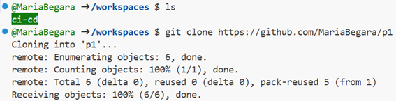
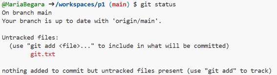
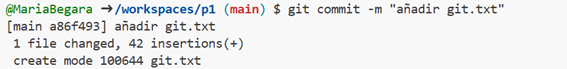
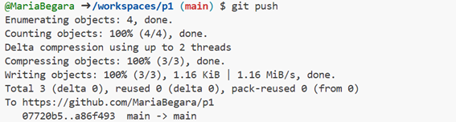
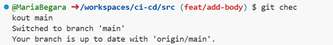

# Práctica 1

Un repositorio para empezar a usar [git](https://git-scm.com/) y Github

## ¿Como probar en la nube?

[Github-Codespaces](https://github.com/features/codespaces)

## Comandos git básicos

```
git clone https://github.com/gitt-3-pat/p1
git status
git add .
git commit -m "TU MENSAJE"
git push

git checkout -b feature/1
git checkout main
```

## ¿Cómo escribir un README.md con formato?

[Github Markdown](https://docs.github.com/es/get-started/writing-on-github/getting-started-with-writing-and-formatting-on-github/basic-writing-and-formatting-syntax)


## Introducción
**Git**: sistema de control de versiones. Una rama es una versión del código que estoy haciendo. Almacena los cambios en binario y comprueba el código en binario, por lo que es mucho más rápido.
**Github**: repositorio de código. Es donde se almacena el código.

En esta práctica se ha preparado el entorno que se utilizará en las próximas prácticas. Además se han aprendido los comandos más relevantes de git. Algunos de ellos son los siguientes:


### git fork
Mediante el fork se ha creado un nuevo repositorio igual que el original (_main_, en este caso). Es decir, hemos creado una bifurcación del código donde podremos editar el código y realizar distintos cambios para, más tarde, propornerlos al repositorio remoto (mediante un pull request). El repositorio bifurcado es un nuevo repositorio que será completamente independiente del repositorio original del que se hizo el fork.


### git clone
Este comando ha servido para clonar el repositorio remoto de la _url_ dada. De esta manera, se ha creado una copia local en _Codespace_ para poder acceder y editar los archivos que contiene. Estos cambios se podrán sincronizar con el repositorio remoto más adelante (mediante commits).
```bash
git clone https://github.com/MariaBegara/p1
```

**Ejemplo práctica:**




### git status
Nos permite visualizar las discrepancias que existen entre el directorio de trabajo y del área del entorno de ensayo. Se ha empleado para verificar si la rama estaba o no actualizada con el repositorio; se ha comprobado si era necesario hacer un add de los cambios para más tarde hacer un _commit_.
```bash
git status
```

**Ejemplo práctica:**




### git add
Permite añadir los cambios que se quieren actualizar al repositorio desde el área del entorno de ensayo. Se puede seleccionar un único archivo o todos para actualizar los cambios que se han hecho en ellos.
```bash
git add .
git add git.txt
```

**Ejemplo práctica:**


### git commit
Se emplea para actualizar los cambios. Para añadir una etiqueta que defina dicho cambio, se debe añadir _"-m mensaje"_, como se muestra a continuación:
```bash
git commit -m "añadir git.txt"
git commit -m "modificación título git.txt"
```

**Ejemplo práctica:**




### git push
Permite subir los cambios actualizados con un _commit_ al repositorio remoto.
```bash
git push
```

**Ejemplo práctica:**




### git checkout
Se utiliza para poder cambiar de rama.
```bash
git checkout main
```

**Ejemplo práctica: **




### git flow
Es el convenio que elige cada equipo de desarrollo para organizar el uso de las ramas del repositorio. Lo que se suele hacer es lo siguiente:
- El _main_ siempre tiene el código válido y desplegable.
- Los cambios se hacen en ramas nuevas desde _main_.
- Las _pull request_ permiten solicitar la incorporación de cambios al _main_.
